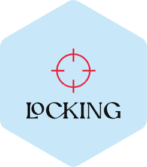

 English | <a href="./README_zh.md">简体中文</a>

Solve vue2 and vue3 non-script setup, thousands of lines of a single file, find the painful pain points of `methods`, and jump into the code directly and quickly through `option` or `ctrl` in `template`💨

## :coffee:

[buy me a cup of coffee](https://github.com/Simon-He95/sponsor)

## License

[MIT](./license)
