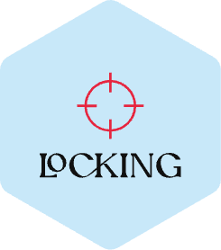

 <a href="./README.md">English</a> | 简体中文

解决 vue2 和 vue3非script setup中，单文件几千行，查找 `methods` 很痛苦的痛点,并且可以直接快速在 `template` 中通过 `option` 或 `ctrl` ，跳入代码💨

## :coffee:

[请我喝一杯咖啡](https://github.com/Simon-He95/sponsor)

## License

[MIT](./license)
